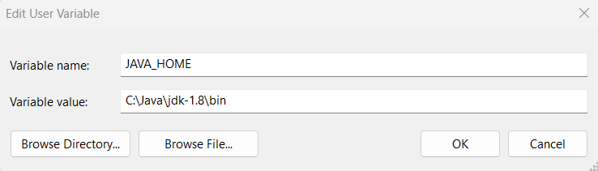
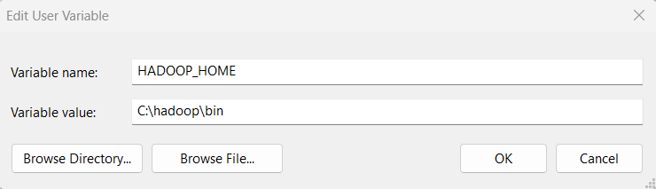

# 🖥️ Setup Hadoop on Windows 11 Machine

This guide provides step-by-step instructions on how to set up and run **Apache Hadoop 3.2.4** on **Windows 11**. The content is based on the official installation process for Hadoop 3.2.4.

# Prerequisites

## Used System Requirements

- Operating System: Windows 11
- Java JDK 8 - used to run Hadoop since it's built using Java
- CMD - used to test environment variables and run Hadoop
- Memory: Minimum 10GB RAM
- Disk Space: Minimum 30GB of available space

## Required Software

- Java Development Kit (JDK)

# Download and Installation

## Step 1: Download Hadoop

Download Hadoop from their official website and unzip the file. Used Hadoop 3.2.4.

## Step 2: Install Java JDK

Java JDK is required to run Hadoop, so if it hasn't been installed, it needs to be installed. It is required by Oracle that users sign up and log in to download it.

# Environment Configuration

## Step 1: Configure Environment Variables

- Open Environment Variables Settings

1. Press Windows + S and type Environment Variables
2. Click on "Edit the system environment variables.
3. In the System Properties window, click the Environment Variables. button at the bottom right

## JAVA_HOME environment variable

1. Under User variables, click New
2. Set the following:
   - Variable name: JAVA_HOME
   - Variable value: Path to your JDK installation (C:\Java\jdk-1.8\bin)



## HADOOP_HOME environment variable

1. Under User variables, click New
2. Set the following:
   - Variable name: HADOOP_HOME
   - Variable value: Path to where you extracted Hadoop (C:\hadoop\bin)



## PATH environment variable

To ensure Hadoop and Java commands run smoothly from any terminal window, add the following directories to your system’s PATH environment variable:

#### Steps to Update:

Press Win + S, search for "Environment Variables", and open it.

Under System Variables, select Path and click Edit.

Click New and add the following paths one by one:

```xml
C:\hadoop\bin
C:\hadoop\sbin
C:\Java\jdk1.8\bin
```

## Create Hadoop Data Directories

Before starting Hadoop, create folders to store NameNode and DataNode data.

#### Steps to Create:

1. Open File Explorer.
2. Navigate to or create the folder:

```xml
C:\hadoop\data
```

3. Inside the data folder, create two subfolders:

```xml
C:\hadoop\data\namenode
C:\hadoop\data\datanode
```

These directories are essential for HDFS to store file system metadata (namenode) and actual block data (datanode).

## Configure Hadoop

Now, the most important part of Hadoop configurations, which involves Core, Yarn, MapReduce, and Httpfs, is ready to be configured. Each of the files is in C:\hadoop\etc.

## Step 1: Configure core site

## core-site.xml

Edit core-site.xml and replace the configuration element with the following:

```xml
<configuration>
    <property>
        <name>fs.defaultFS</name>
        <value>hdfs://localhost:9000</value>
    </property>
</configuration>
```

## httpfs-site.xml

Edit httpfs-site.xml and replace the configuration element with the following:

```xml
<configuration>
    <property>
        <name>dfs.replication</name>
        <value>1</value>
    </property>
    <property>
        <name>dfs.namenode.name.dir</name>
        <value>C:\hadoop\data\namenode</value>
    </property>
    <property>
        <name>dfs.datanode.data.dir</name>
        <value>C:\hadoop\data\datanode</value>
    </property>
</configuration>
```

## Configure MapReduce and Yarn site

Edit mapred-site.xml and replace the configuration element with the following:

```xml
<configuration>
    <property>
        <name>mapreduce.framework.name</name>
        <value>yarn</value>
    </property>
    <property>
        <name>mapreduce.map.java.opts</name>
        <value>-Xmx4096m</value>
    </property>
    <property>
        <name>mapreduce.reduce.java.opts</name>
        <value>-Xmx6144m</value>
    </property>
</configuration>
```

Edit yarn-site.xml and replace the configuration element with the following:

```xml
<configuration>
    <property>
        <name>yarn.resourcemanager.hostname</name>
        <value>localhost</value>
    </property>
    <property>
        <name>yarn.nodemanager.aux-services</name>
        <value>mapreduce_shuffle</value>
    </property>
    <property>
        <name>yarn.nodemanager.auxservices.mapreduce.shuffle.class</name>
        <value>org.apache.hadoop.mapred.shuffleHandler</value>
    </property>
    <property>
        <name>yarn.nodemanager.resource.memory-mb</name>
        <value>10240</value>
    </property>
    <property>
        <name>yarn.nodemanager.resource.cpu-vcores</name>
        <value>4</value>
    </property>
    <property>
        <name>yarn.scheduler.maximum-allocation-mb</name>
        <value>8192</value>
    </property>
    <property>
        <name>yarn.scheduler.maximum-allocation-vcores</name>
        <value>2</value>
    </property>
    <property>
        <name>yarn.nodemanager.health-checker.script.enable</name>
        <value>false</value>
    </property>
    <property>
        <name>yarn.nodemanager.disk-health-checker.max-disk-utilization-per-disk-percentage</name>
        <value>98.5</value>
    </property>
</configuration>
```

## Node Setup

All commands in this section must be run in Command Prompt (CMD) as Administrator to avoid permission issues.

- Open the Start Menu
- Type cmd, right-click on Command Prompt, and select Run as administrator
- Now, run the setup commands in this window

### Initialize HDFS and bugfix

Format the NameNode

```xml
hdfs namenode -format
```

## Start HDFS daemons

The following command should be run to start the HDFS daemons. When it is executed, two new windows should be opened: one for the DataNode and the other for the NameNode.

```xml
start-dfs.cmd
```

## Start YARN daemons

The following command should be run (with elevated permissions) to start the YARN daemons. When executed, two new windows should be opened: one for the ResourceManager and the other for the NodeManager.

```xml
start-yarn.cmd
```

Or started all services at once

```xml
start-all.cmd
```

### Verify the Installation

Check running processes

```xml
jps
```

### Expected output should include:

- NameNode
- DataNode
- ResourceManager
- NodeManager

## Shutdown YARN and HDFS daemons

The daemons can be stopped by running the following commands.

```xml
stop-dfs.cmd
stop-yarn.cmd
```

Or stopped all services at once

```xml
stop-all.cmd
```

## Running MapReduce Jobs

Once the Hadoop environment is ready, follow these steps to run the hashtag counter MapReduce job:
This command compiles your MapReduce source files (HashtagMapper.java, HashtagReducer.java, and HashtagDriver.java) and stores the compiled .class files in the classes directory.
Run this in the VS Code terminal

### Step 1: Compile Java Files

```xml
$hadoopJars = (Get-ChildItem -Recurse "C:\hadoop\share\hadoop" -Include *.jar | ForEach-Object { $_.FullName }) -join ';'
```

This PowerShell command gathers all .jar files inside your Hadoop directory (recursively), then joins them into a single string with ; separators (required for Java classpath).

```xml
javac -classpath "$hadoopJars" -d classes src\HashtagMapper.java src\HashtagReducer.java src\HashtagDriver.java
```

This compiles the three Java source files and places the compiled .class files inside a folder called classes.

### Step 2: Create a JAR File

```xml
jar -cvf hashtag-count.jar -C classes .
```

### Step 3: Upload Input to HDFS

Run these commands one by one in the VS Code terminal

1. Delete old input directory from HDFS (if it exists)

```xml
hdfs dfs -rm -r -f /user/DELL/input
```

This command removes any previous input folder in the HDFS path. It helps avoid conflicts from previous uploads.

2.  Delete old output directory from HDFS (if it exists)

```xml
hdfs dfs -rm -r -f /user/DELL/output
```

This removes the output directory in HDFS from a previous run. It is required because Hadoop won't overwrite output folders.

3. Create a new input directory in HDFS

```xml
hdfs dfs -mkdir -p /user/DELL/input
```

This creates a new input directory in HDFS to hold the data file.

4. Upload the input CSV file to HDFS
   ```xml
   hdfs dfs -put -f input/movie_tweet_sample.csv /user/DELL/input/
   ```

This uploads your local CSV file (movie_tweet_sample.csv) from the input folder in your local project into the HDFS input directory.

#### Final HDFS Structure:

```xml
/user/DELL/input/movie_tweet_sample.csv
```

### Step 4: List content in the input directory

```xml
hdfs dfs -ls /user/DELL/input
```

### Step 5: Start the Job

```xml
hadoop jar hashtag-count.jar HashtagDriver /user/DELL/input/movie_tweet_sample.csv /user/DELL/output
```

### Step 6: List content in the output directory

```xml
hdfs dfs -ls /user/DELL/output
```

### Step 7: Display output

```xml
hdfs dfs -cat /user/DELL/output/part-r-00000
```

### Step 8: Save output to a text file

```xml
hdfs dfs -cat /user/DELL/output/part-r-00000 > output/result.txt
```

### Step 9: Visualize the Output (Optional)

Once the result is saved as a text file, visualize the data using Python:

Install required libraries:

```xml
pip install pandas matplotlib
```

Navigate to the analysis folder:

```xml
cd analysis
```

Run the visualization script:

```xml
python visualize_results.py
```

## Shutdown Services After Completion

```xml
stop-dfs.cmd
stop-yarn.cmd
```

or

```xml
stop-all.cmd
```

## Monitoring and Health Checks

### Web Interface Access

- NameNode Web UI: http://localhost:9870
- ResourceManager Web UI: http://localhost:8088

## Final folder structure after compilation:

```xml
MOVIEHASHTAGMAPREDUCE/
├── analysis/
│   └── visualize_results.py
│   └──plots/
│   	└── top_hashtags.png
├── input/
│   └── movie_tweet_sample.csv
├── output/
│   └── result.txt
├── src/
│   ├── HashtagDriver.java
│   ├── HashtagMapper.java
│   └── HashtagReducer.java
├── classes/
│   ├── HashtagDriver.class
│   ├── HashtagDriver.class
│   └── HashtagDriver.class
└── hashtag-count.jar
```
